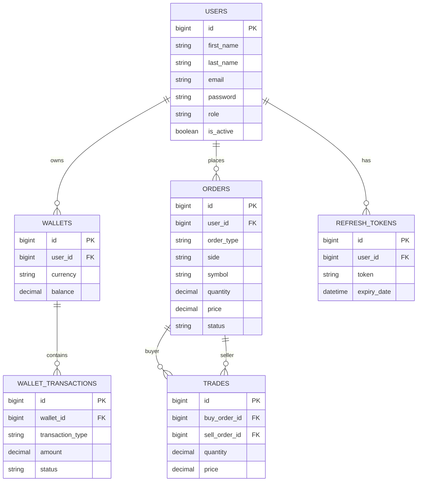

# Database Design

## Project

Centralized Cryptocurrency Exchange Platform

---

# Purpose

This document defines the database structure of the application.

It explains

- Tables
- Relationships
- Primary Keys
- Foreign Keys
- Constraints
- Indexes

The goal is to design a secure, scalable and normalized database before development begins.

---

# Database

PostgreSQL

---

## ER Diagram

---

# Table : users

Purpose

Stores registered users.

Columns

- id (PK)
- first_name
- last_name
- email
- password
- role
- is_active
- created_at
- updated_at

Primary Key

id

Constraints

- Email must be unique.
- Password must be encrypted.

---

# Table : wallets

Purpose

Stores user wallet information.

Columns

- id
- user_id
- currency
- balance
- created_at

Primary Key

id

Foreign Key

user_id → users.id

Relationship

One User → Many Wallets

Example

Azam

↓

USD Wallet

BTC Wallet

ETH Wallet

---

# Table : wallet_transactions

Purpose

Stores every wallet transaction.

Columns

- id
- wallet_id
- transaction_type
- amount
- reference
- status
- created_at

Transaction Types

- Deposit
- Withdraw
- Trade Credit
- Trade Debit

Relationship

One Wallet

↓

Many Transactions

---

# Table : orders

Purpose

Stores buy and sell orders.

Columns

- id
- user_id
- order_type
- side
- symbol
- quantity
- price
- remaining_quantity
- status
- created_at

Order Types

- Market
- Limit

Side

- Buy
- Sell

Status

- Pending
- Partially Filled
- Filled
- Cancelled

Relationship

One User

↓

Many Orders

---

# Table : trades

Purpose

Stores completed trades.

Columns

- id
- buy_order_id
- sell_order_id
- buyer_id
- seller_id
- price
- quantity
- trade_time

Relationship

Trade

↓

One Buy Order

+

One Sell Order

---

# Table : refresh_tokens

Purpose

Stores refresh tokens.

Columns

- id
- user_id
- token
- expiry_date
- revoked

Relationship

One User

↓

Many Refresh Tokens

---

# Relationships

Users

↓

Wallets

↓

Wallet Transactions

-------------------------

Users

↓

Orders

↓

Trades

-------------------------

Users

↓

Refresh Tokens

---

# Indexes

Create indexes on

- email
- symbol
- status
- created_at
- user_id

Purpose

Improve query performance.

---

# Constraints

- Email must be unique.
- Balance cannot be negative.
- Quantity must be greater than zero.
- Price must be greater than zero.
- Foreign keys must always exist.
- Password must never be stored as plain text.

---

# Normalization

The database follows Third Normal Form (3NF).

Benefits

- No duplicate data.
- Better consistency.
- Easier maintenance.
- Faster updates.

---

# Future Tables

Version 2

- notifications
- audit_logs
- watchlist
- price_history
- supported_coins
- admin_logs
- api_keys

---

# Database Principles

- ACID Transactions
- Referential Integrity
- Data Consistency
- Proper Indexing
- Secure Storage
- Normalized Design